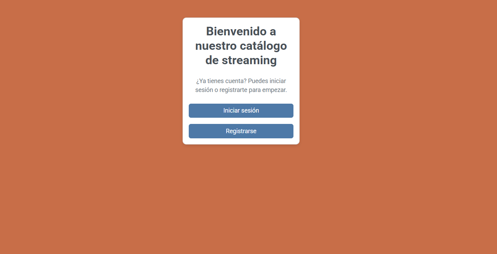
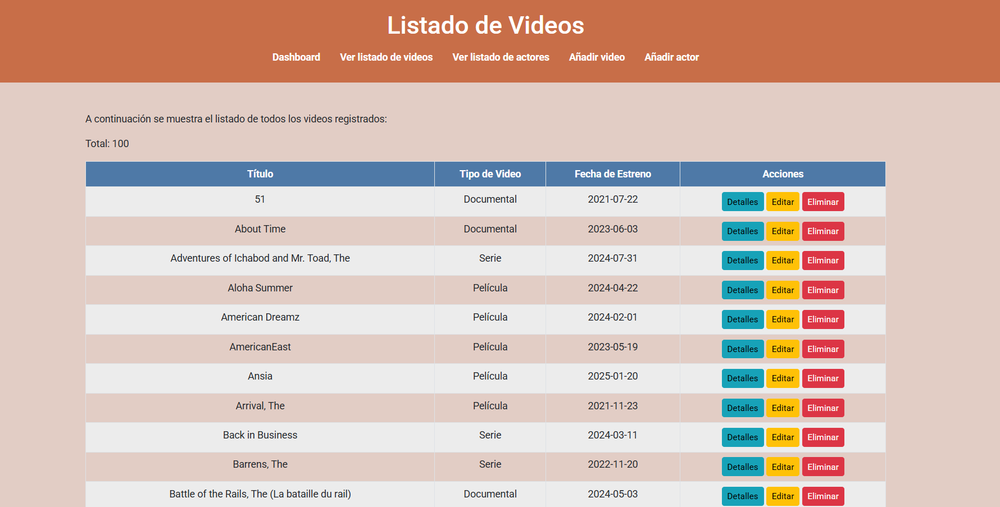

# STREAMING PROJECT

## Descripción

Este proyecto es una plataforma de gestión de contenido multimedia, que permite administrar películas, videos y documentales, así como la información de los actores involucrados. Ha sido desarrollado utilizando **PHP**, **Bootstrap**, **MySQL**, y **Apache** para ofrecer una experiencia dinámica y eficiente.

## Requisitos

Para ejecutar este proyecto necesitarás un entorno con:

- **Apache**
- **MySQL**
- **PHP**

## Funcionalidades del proyecto

El proyecto debe cumplir con los siguientes requisitos:

1. Crear un login
2. Crear un registro
3. Mostrar todos los videos
4. Mostrar los detalles de cada video
5. Editar los videos
6. Eliminar los videos
7. Mostrar todos los actores
8. Editar los actores
9. Añadir los videos
10. Añadir los actores

## Estructura del proyecto

- **config/**
  - `db.php` → Configuración de la base de datos.
- **public/** (Páginas accesibles por los usuarios)
  - `index.php`
  - `register.php`
  - `login.php`
  - `logout.php`
  - `dashboard.php`
  - `show_videos.php`
  - `show_actors.php`
  - `details_videos.php`
  - `details_actors.php`
  - `edit_video.php`
  - `edit_actor.php`
  - `add_video.php`
  - `add_actor.php`
- **src/** (Lógica de negocio)
  - `VideoManager.php`
  - `ActorManager.php`
  - `Auth.php`
  - `User.php`
- **temporal/** (Archivos temporales)
  - `compr_auth.php`
  - `compr_conexion.php`
- **sql/**
  - `database.sql` → Script de la base de datos.
- **images/** (Carpeta para almacenar imágenes del proyecto)
  - `index_view.png` → Imagen de la página de inicio.
  - `video_list.png` → Imagen del listado de videos.

## Muestras visuales de la interfaz

A continuación se presentan algunas imágenes de la interfaz del proyecto:

- **Vista de la página de inicio:**
  

- **Listado de videos disponibles:**
  

